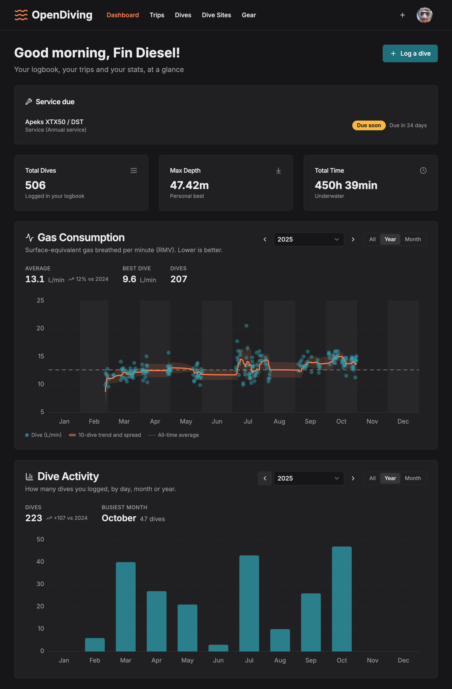
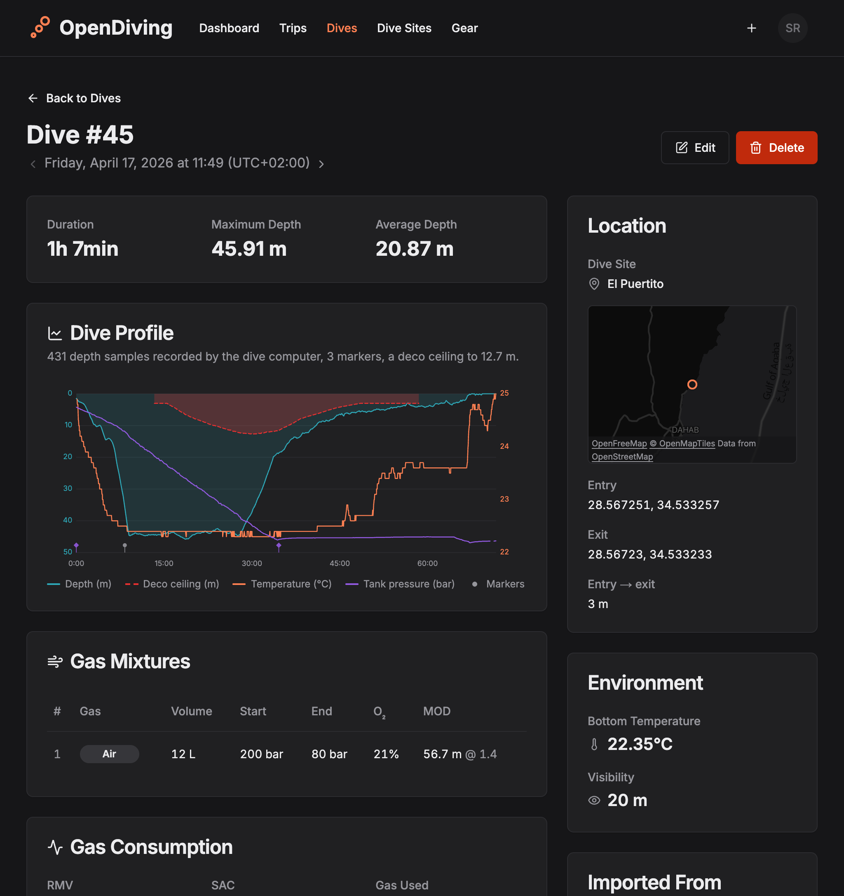
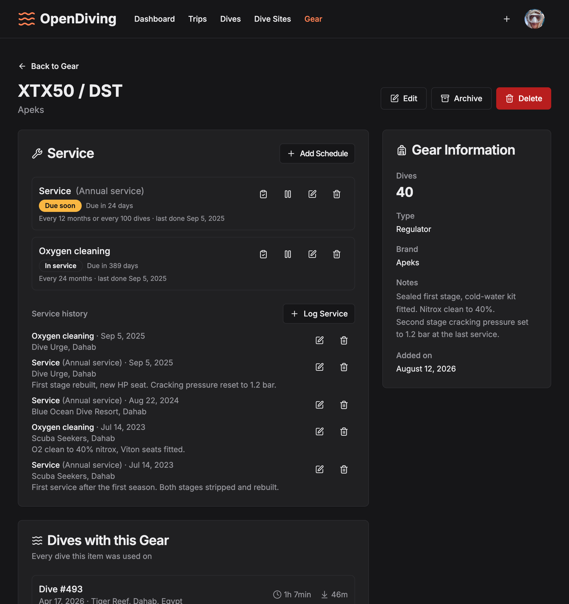

# OpenDiving Web

**A dive log built to outlive every vendor. Your dives, your data — original files kept, open
formats, and yours to self-host.**

OpenDiving is an open-source logbook for scuba divers — recreational and technical: log dives with
multi-tank gas mixtures (nitrox and trimix), import dives straight from your dive computer's export
file — full depth/temperature/tank-pressure profile, deco ceiling and dive events included — group
them into trips, and keep your gear service history and c-cards in one place.

Cloud dive logs come and go — Movescount, Deepblu, Diveboard — and when they go, years of dive
history go with them. OpenDiving is built on a different premise: the app is AGPL-licensed, the data
sits in a plain Postgres database, and every dive keeps the original dive-computer export it was
imported from, downloadable at any time. Self-hosting isn't a feature here; it's the guarantee
behind the rest — anyone can run this software, one click hands the whole log back in open formats,
and the app reads its own DiveJSON straight back in, so no shutdown, acquisition, or paywall can
ever take your logbook with it.

**This repository is the web app — one component of the stack.** The project itself, and everything
about running it, lives at **[opendiving/opendiving](https://github.com/opendiving/opendiving)**:
the install, the configuration reference, the operator guides and the release that ties the
components together. Start there if you want to run OpenDiving rather than work on this half of it.



## Features

- **Dive logging** — times, depths, duration, temperature, visibility, water type, altitude, weight,
  notes, and any number of gas mixtures (O₂/He, start/end pressures) per dive. A dive can span
  multiple dive sites (drift dives happen), in order. Switch off the fields you never fill in and
  save the arrangement as a named set — the choice follows your account, not the device.
- **Technical diving** — trimix and nitrox mixes get derived gas names and per-mix **MOD** at your
  ppO₂ limit, plus END/EAD; the profile chart shades the **deco ceiling** and marks dive events;
  **CNS/OTU** oxygen exposure and surface pressure are kept from imports, per-cylinder ppO₂ limits
  and gas roles included.
- **Dive-computer import** — upload a FIT file (Garmin Descent, Suunto Ocean/D5) or a Suunto
  XML/JSON export and the form pre-fills itself, keeping the file's own UTC offset where it records
  one (FIT and the JSON exports do; Suunto's XML carries no offset at all, so those fall back to
  your current timezone). The original file is stored with the dive and can be re-downloaded
  anytime; the per-sample **dive profile** (depth, temperature, tank pressure, deco ceiling, events)
  is extracted and charted on the dive page.
- **Air consumption** — SAC and RMV are derived automatically, including a **per-tank breakdown**
  across recorded gas switches on multi-tank dives, with a consumption trend chart on the dashboard.
- **Trips** — group dives into a liveaboard or a holiday week, with location and dates.
- **Dive sites** — your personal site list, with every dive you've logged at each site.
- **Gear tracking** — your equipment with per-item dive counts, groupable into gear sets you can
  attach to a dive in one click, plus **service schedules** (annual service, visual inspection,
  hydro test…) with due-soon reminders on the dashboard and by email.
- **Marine life** — record what you saw against a real species catalog, resolved live against the
  World Register of Marine Species and Wikidata so a name you half-remember still finds the animal.
  Your **life list** collects every species you have ever logged, with a photograph fetched once
  from Wikimedia Commons and served from the instance you are on — your browser never talks to
  Wikimedia, and each species has a page carrying its credit, its classification and the dives you
  saw it on.
- **Certifications** — keep photos of your c-cards on hand at the dive shop without digging out the
  plastic.
- **Courses** — the training itself, with the agency, instructor and shop: link the dives you did on
  it and the cards it issued, so a course is one record instead of a shape you have to remember.
- **Full export** — one click to take _everything_ out in open formats: a **DiveJSON** document
  holding the whole logbook, a **UDDF** one other programs import, a **CSV** for a spreadsheet, or a
  complete **archive** carrying all three alongside every dive-computer file you uploaded and both
  sides of every c-card. [DiveJSON](https://divejson.org) is the open dive-log interchange format
  this project maintains, and this app is its reference implementation. A data-ownership log without
  an exit door is a contradiction.
- **Logbook import** — and a door that only opens outwards is half a promise, so the DiveJSON
  document and the archive read straight back in: move a logbook between instances, or restore one
  from a backup. You see a full report of what it would do — new records, ones already present,
  dives it would bring back from deletion, and anything it could not represent — before a single row
  is written. Records you already have are matched rather than duplicated, and a dive you deleted
  returns under its own identity. The archive additionally restores the dive-computer files and
  c-card scans, which the bare document names by digest but does not carry.
- **Passwordless sign-in** — email magic links or Google; no passwords stored, ever.
- **Dark mode & responsive** — works on the boat, in the dive shop, and on your desk.

|                                                                                                     |                                                                                      |
| --------------------------------------------------------------------------------------------------- | ------------------------------------------------------------------------------------ |
|  |  |

## Planned

Roadmap items, roughly in priority order — contributions welcome:

- **More importers** — Subsurface XML and UDDF (which also covers Apple Watch dives via Oceanic+'s
  UDDF export), then Shearwater Cloud exports; a pluggable importer layer so every format someone is
  stranded with is a migration path in. Longer term,
  [libdivecomputer](https://www.libdivecomputer.org/) for direct hardware support.
- **Statistics** — depth/time records, dives per year, sites map.
- **Sharing** — public link to a dive or trip.
- **iOS companion app** — parked until the server story is done
  ([opendiving-ios](https://github.com/opendiving/opendiving-ios)).

## How it compares

Honest answers to "why not X":

- **[Subsurface](https://subsurface-divelog.org/)** — the open-source reference, with unmatched
  dive-computer support and a full deco planner. It's desktop-first with no web app or self-hostable
  server; OpenDiving is the server-shaped complement — a modern web UI, API-first, reachable from
  any browser, and self-hostable on a box of your own. Use Subsurface to download from cables; a
  Subsurface import is high on the roadmap so both can hold the same log.
- **[Submersion](https://submersion.app/) / [Bubbletrail](https://bubbletrail.app/)** — excellent
  newer open-source _apps_: local-first, on-device databases, Bluetooth downloads. OpenDiving is the
  server-shaped alternative: one instance behind every browser and every family member, with an API
  — and yours to run on the household server if that is where you want it.
- **Vendor clouds (Shearwater, Garmin, Suunto, Oceanic+)** — where dives are born, not where they
  should live. OpenDiving imports their exports and keeps the original file forever, so switching
  computers never splits your history.

## Self-hosting

One compose file brings up the whole stack — this app, the API and its worker, Postgres, Redis, and
a Caddy that provisions TLS for your domain. That file is not in this repository and neither are the
instructions for it: an install is a product-level thing, so it is driven from
**[opendiving/opendiving](https://github.com/opendiving/opendiving)** — the four commands, the six
values in the `.env` that matter, and the upgrade are all on that page.

What this repository contributes to it is one image. `ghcr.io/opendiving/opendiving-web` is prebuilt
for amd64 and arm64, so a Raspberry Pi runs the same bytes as a VPS and there is no build step and
no Node on the host; it is pulled alongside the API's by that compose file.

**[Full self-hosting docs](https://github.com/opendiving/opendiving/tree/main/docs)** — install,
every configuration variable, running behind your own reverse proxy instead of the bundled Caddy,
backup and restore, upgrades, and troubleshooting. They live in one place rather than half here and
half there.

### Building the image yourself

The published image is what a `docker build` in this repository produces, so a fork or a local
change is one build away:

```bash
docker build -t opendiving-web .
docker run -p 3000:3000 -e API_INTERNAL_URL=http://your-api-host:8000 opendiving-web
```

Nothing about your instance is baked into that image. The browser calls `/api/v1` on whatever origin
served the page, and this app's own route handler forwards each request to `API_INTERNAL_URL` — an
origin with no `/api/v1` on the end, read fresh on every request. Its default is `http://api:8000`,
the API's service name on a compose network, so a container swapped into the shipped bundle needs
the variable no more than the published image does. The rest of the settings are read on the server
at request time too, so they are plain environment variables on the container:
[`.env.example`](.env.example) documents each one.

The image carries its own `HEALTHCHECK` against `/healthz`, which reports that this process is
serving HTTP and deliberately nothing more — the web container talks to neither Postgres nor Redis,
and the API owns readiness. Two settings are worth knowing when you are the one deciding how this is
served rather than taking the bundle's answer: `WEB_HSTS=off` hands `Strict-Transport-Security` to a
proxy in front, or drops it for a plain-HTTP LAN address, and `WEB_NOINDEX=true` keeps an instance
that is reachable but private out of search engines.

The single exception to runtime configuration is `NEXT_PUBLIC_API_URL`, for a split-origin
deployment where the API answers on a host of its own and the browser should reach it directly
instead of through this app:

```bash
docker build --build-arg NEXT_PUBLIC_API_URL=https://api.example.com/api/v1 -t opendiving-web .
```

It is the full base with the `/api/v1` prefix included, and `NEXT_PUBLIC_*` values are inlined into
the client bundle by the compiler — so that address is fixed at build time and changing it means
rebuilding, which is exactly why it is no longer the default path. It is also one of the two things
the CSP's `connect-src` is derived from — the other is the basemap, whose host comes from the
runtime settings `.env.example` documents — so an API or basemap host reached any other way is
blocked rather than merely misconfigured. Left unset, none of this applies.

## Development setup

The web app is the frontend for [opendiving-api](https://github.com/opendiving/opendiving-api) —
start that first (one `docker compose up`), then:

```bash
npm install
cp .env.example .env   # points at http://localhost:8000/api/v1 by default
npm run dev
```

Open [http://localhost:3000](http://localhost:3000), sign in with your email, and log your first
dive. Without a configured email provider on the API side, the magic link is printed to the API logs
— handy for local development.

### Scripts

| Command                       |                                                     |
| ----------------------------- | --------------------------------------------------- |
| `npm run dev`                 | Development server                                  |
| `npm run build` / `npm start` | Production build / serve                            |
| `npm run lint`                | ESLint                                              |
| `npm run type-check`          | TypeScript                                          |
| `npm test`                    | Unit tests (`test:watch`, `test:coverage` variants) |

## Tech stack

Next.js (App Router) + TypeScript, Tailwind CSS, shadcn/ui with Radix primitives, react-hook-form +
Zod validation, axios. The dive-profile and consumption charts are hand-rolled SVG — no charting
library.

## Contributing

Issues and PRs are welcome — from a typo fix to a new importer. Open an issue first for bigger
features so we can agree on the shape. See [CONTRIBUTING.md](CONTRIBUTING.md) for setup, the checks
CI runs, and the house rules, and [DECISIONS.md](DECISIONS.md) for the non-obvious choices already
made. Security problems go through [SECURITY.md](SECURITY.md) rather than the issue tracker.

## Related repositories

|                                                                |                                                         |
| -------------------------------------------------------------- | ------------------------------------------------------- |
| [opendiving](https://github.com/opendiving/opendiving)         | The product: install bundle, operator docs, the release |
| [opendiving-api](https://github.com/opendiving/opendiving-api) | FastAPI backend (Postgres, Redis, dive-file parsing)    |
| [opendiving-ios](https://github.com/opendiving/opendiving-ios) | SwiftUI app (early scaffold, parked)                    |

## License

[AGPL-3.0](LICENSE). In short: run it, change it, self-host it freely — but if you offer a modified
version as a service, you share your changes. Nobody gets to take this closed-source and lock
divers' data away.

Third-party artwork and vendored assets that travel in this tree — Google's sign-in mark, the
MapLibre build, the OpenFreeMap styles — are credited in [NOTICE.md](NOTICE.md). The brand mark
isn't among them: it's original to this project.
